This Genesys Cloud Developer Blueprint provides instructions for building a Slack integration using open messaging. This allows customers using Slack have an open message interaction with a Genesys Cloud agent.

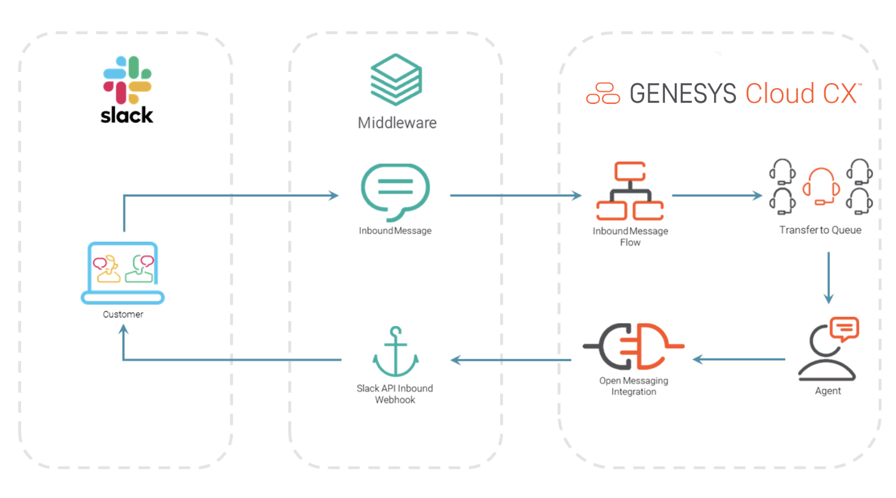

## Contents

* [Solution components](#solution-components "Goes to the Solution components section")
* [Prerequisites](#prerequisites "Goes to the Prerequisites section")
* [Implementation steps](#implementation-steps "Goes to the Implementation steps section")
* [Additional resources](#additional-resources "Goes to the Additional resources section")

## Solution components

* **Genesys Cloud** - A suite of Genesys cloud services for enterprise-grade communications, collaboration, and contact center management. You deploy the Chat Translator solution in Genesys Cloud.
* **Slack Workspace** - Slack is a channel-based messaging platform. Your Slack workspace is where people can work together, connect all their software tools and services, and find the information they need to do their best work.

### Software development kits (SDKs)

* **Genesys Cloud Platform API SDK** - Client libraries used to simplify application integration with Genesys Cloud by handling low-level HTTP requests. This SDK is used for the initial chat interaction between agent and customer.

## Prerequisites

### Specialized knowledge

* Administrator-level knowledge of Genesys Cloud
* Experience using the Genesys Cloud Platform API
* Experience using the Slack API

### Genesys Cloud account requirements

* A Genesys Cloud license. For more information, see [Genesys Cloud Pricing](https://www.genesys.com/pricing "Opens the Genesys Cloud pricing page") in the Genesys website.
* The Master Admin role. For more information, see [Roles and permissions overview](https://help.mypurecloud.com/?p=24360 "Opens the Roles and permissions overview article") in the Genesys Cloud Resource Center.

### Slack account requirements

* A user account with Workspace Owner account type

## Implementation steps

* [Download the repository containing the project files](#download-the-repository-containing-the-project-files "Goes to the Download the repository containing the project files section")
* [Setting up Gensys Cloud](#setting-up-geneys-cloud "Goes to the Setting up Genesys Cloud section")
* [Setting up Slack](#setting-up-slack "Goes to the Setting up Slack section")
* [Update common-variables.js](#update-common-variablesjs "Goes to the Update common-variables.js section")
* [Run the middleware](#run-the-middleware "Goes to the Run the middleware section")
* [Test to solution](#test-the-solution "Goes to the Test the solution section")

### Download the repository containing the project files

1. Clone the [slack-open-messaging-blueprint repository](https://github.com/GenesysCloudBlueprints/slack-open-messaging-blueprint "Opens the slack-open-messaging-blueprint repository in GitHub").

### Setting up Geneys Cloud

#### Create a client credentials OAuth grant

1. Log in to your Genesys Cloud organization and create a new OAuth client that uses the Client Credentials type. For more information, see [Create an OAuth client](https://help.mypurecloud.com/articles/?p=188023 "Opens the Create an OAuth client article") in the Genesys Cloud Resource Center.
2. In your local blueprint repository, open the [/docs/common-variables.js](https://github.com/GenesysCloudBlueprints/slack-open-messaging-blueprint/blob/main/docs/common-variables.js) file. Add the client ID and secret from your OAuth client.

#### Create Open Messaging Platforms

We are going to create 2 Open Messaging platforms. One for direct messages and another for app mention.

1. In Genesys Cloud Admin, navigate to **Message > Platforms**.
2. Click **+ Add Platform** and choose **Open Messaging**.
3. Enter **Open Messaging Direct Message** in the **Name** field.
4. Enter `https://corpuz-om.loca.lt/slack/openmessaging/slack` as **Outbound Notification Webhook URL**.
5. Enter a value for **Outbound Notification Webhook Signature Secret Token**. Make note of your secret token and place this value in the `open_messaging_secret_token` [/docs/common-variables.js](https://github.com/GenesysCloudBlueprints/slack-open-messaging-blueprint/blob/main/docs/common-variables.js) file.

Create another Platform for app mention using the same values with **Open Messaging App Mention** as the **Name**.

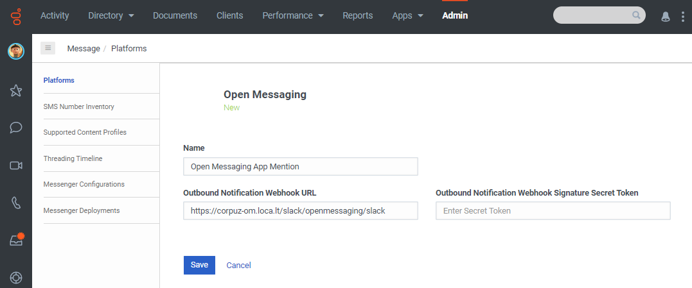

#### Create Inbound Message Flow

Same with platforms, we are going to create 2 Inbound Message flow for direct messages and another for app mention.

1. In Genesys Cloud Architect, add an **Inbound Message** flow.
2. Click **+ Add** and enter **Slack Direct Message** as the **Name** of the flow. Click **Create Flow**.
3. You may opt to send a response message before transferring to a queue for testing purposes.
4. Transfer to ACD and choose a queue.
5. Click **Save** and **Publish**.

Create another Inbound Message flow with **Slack App Mention** as the **Name**.

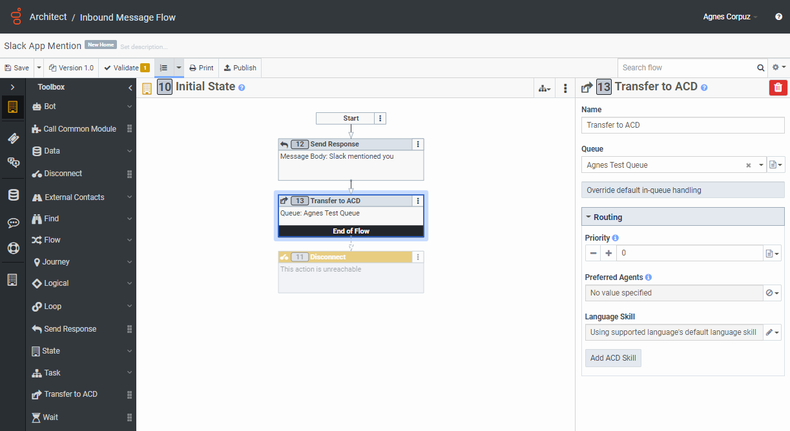

#### Create Message Routing

We are again going to create 2 Message Routing for direct message and app mention.

1. In Genesys Cloud Admin, navigate to **Routing > Message Routing**.
2. Click **+**, select the **Slack Direct Message** in the **Flow** and the **Open Messaging Direct Message** as the **Addresses**.
3. Click **Save**.

Create another Message Route for app mention.

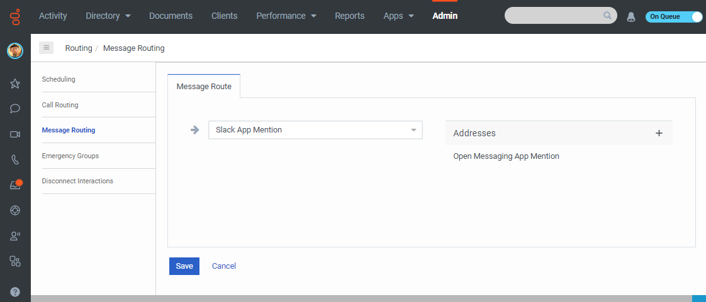

### Setting up Slack

#### Enable Incoming Webhooks

1. Create a Slack app and choose a Slack workspace to associate your app with. For more information, see [Sending messages using Incoming Webhooks](https://api.slack.com/messaging/webhooks "Opens Sending messages using Incoming Webhooks") in the Slack API documentation.
2. From you Slack app's management dashboard, navigate to the **Incoming Webhooks** feature. Toggle the **Activate Incoming Webhooks** and click the **Add New Webhook to Workspace**. Pick a channel that the app will post to and click to **Authorize** your app.
   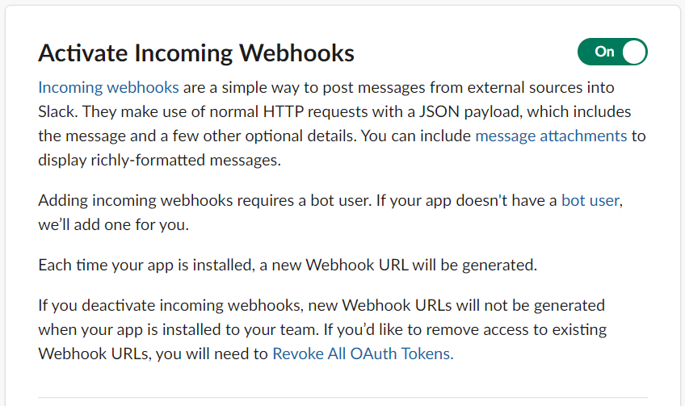

#### Event Subscriptions

1. From your Slack app's management dashboard, navigate to **Event Subscriptions**. 
2. Toggle the **Enable Events** and add `https://corpuz-om.loca.lt/slack/openmessaging/genesys` as the **Request URL**. Be sure that the **Request URL** returns **Verified** after pasting the URL.
   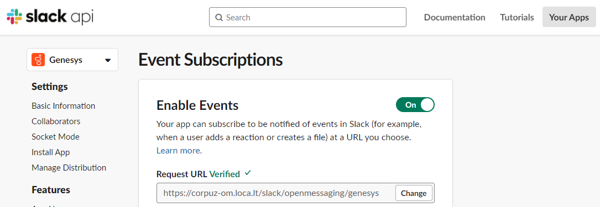
3. Scroll down to **Subscribe to bot events** and add `app_mention` and `message:im`.
   
4. Click **Save Changes**.

#### OAuth and Permissions

1. From your Slack app's management dashboard, navigate to **OAuth & Permissions**.
2. Scroll to **OAuth Tokens for Your Workspace** and copy the **Bot User OAuth Token** and paste this value in the `slack_bearer_token` [/docs/common-variables.js](https://github.com/GenesysCloudBlueprints/slack-open-messaging-blueprint/blob/main/docs/common-variables.js) file.
   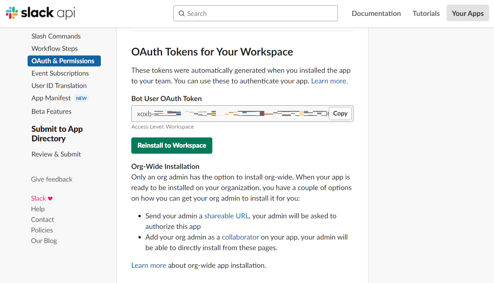
3. Scroll to **Scopes** and add the following **Bot Token Scopes**: `app_mentions:read`, `chat:write`, `im:history`, and `incoming-webhook`.
   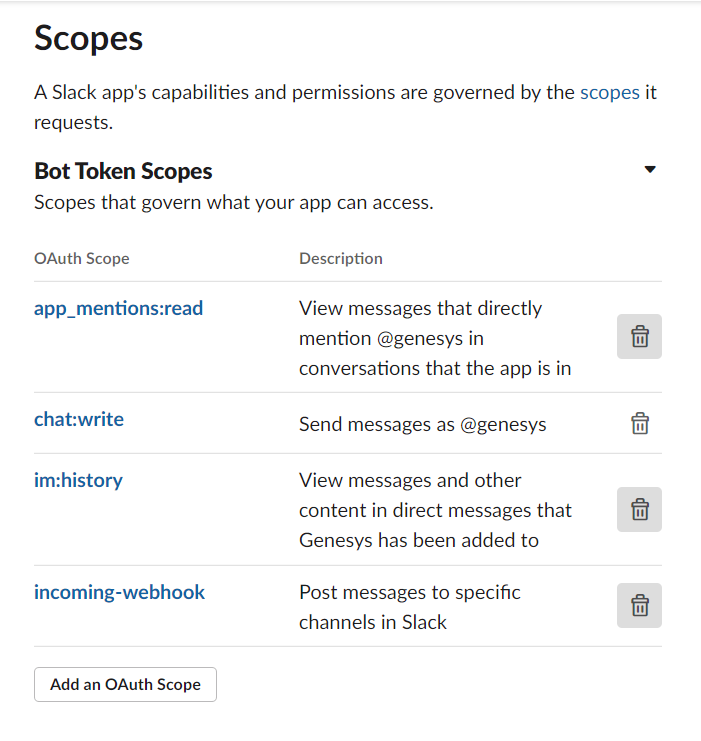

#### Enable Bots

1. From your Slack app's management dashboard, navigate to **App Home**.
2. Scroll to **Show Tabs**, toggle **Message Tab** and tick the **Allow users to send Slash commands and messages from the message tab**.
   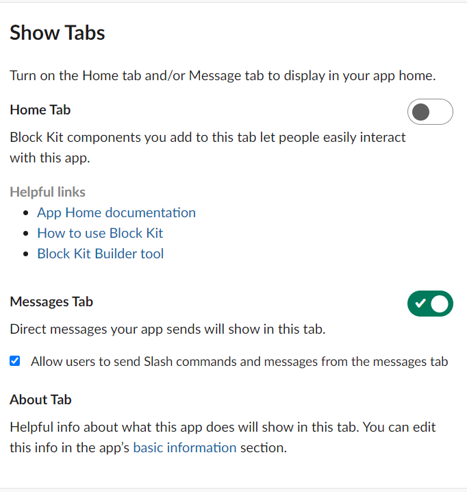

### Update common-variables.js
1. Genesys Cloud OAuth
   - **clientId** - Place your client ID using the Client Credentials grant type.
   - **clientSecret** - Place your client secret using Client Credentials grant type.
2. Open Messaging
   - **open_messaging_secret_token** - The value of **Outbound Notification Webhook Signature Secret Token** when the Open Messaging Platform was configured.
   - **open_messaging_direct_messaging_id** - Run GET /api/v2/conversations/messaging/integrations/open and place the ID of **Open Messaging Direct Message**.
   - **open_messaging_app_mention_id** - Run GET /api/v2/conversations/messaging/integrations/open and place the ID of **Open Messaging App Mention**.
3. Slack Configuration
   - **app_verification_token** - From Slack app's management dahboard, go to **Basic Information**, scroll to **App Credentials** and copy the value of **Verification Token**.
   - **slack_bearer_token** - From Slack app's management dahboard, go to **OAuth & Permissions**, scroll to **OAuth Tokens for Your Workspace** and copy the value of **Bot User OAuth Token**.
   - **slack_app_mention_channel** - Launch Slack and right click to your Channnel. Select **Open channnel details**. Copy the **Channel ID** at the very bottom of the page.

### Run the middleware

1. Switch to the directory where the files for your Chat Translator project are located and install the dependencies in the local node-modules folder. In the command line, type `npm install`.
2. To run the server locally, in the command line type `node index.js`.

### Test the solution

#### Slack App Mention

1. As a Genesys Cloud agent, make sure you are **On Queue** to receive incoming interactions.
2. Go to Slack and mention your Slack app.
3. Slack app should send the message configured in the **Architect Inbound Message** flow.
4. Your Genesys Cloud agent should be able to receive the message from Slack and have a conversation with the customer.
  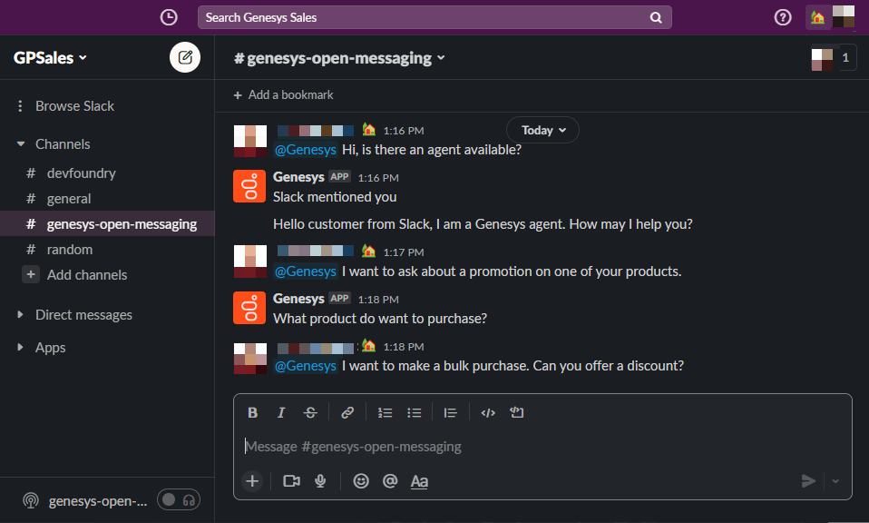
  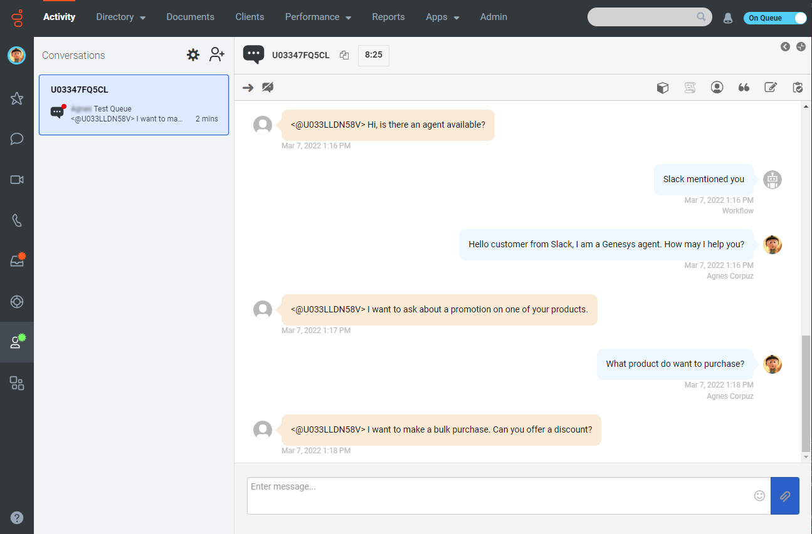

#### Direct Message

1. As a Genesys Cloud agent, make sure you are **On Queue** to receive incoming interactions.
2. Go to Slack and send a message in your Slack app.
3. Slack app should send the message configured in the **Architect Inbound Message** flow.
4. Your Genesys Cloud agent should be able to receive the message from Slack and have a conversation with the customer.
  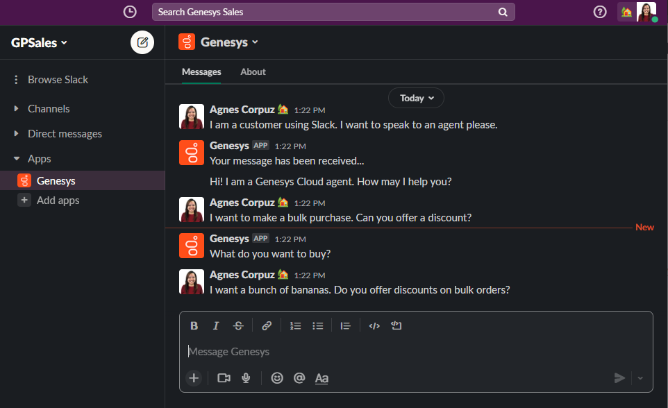
  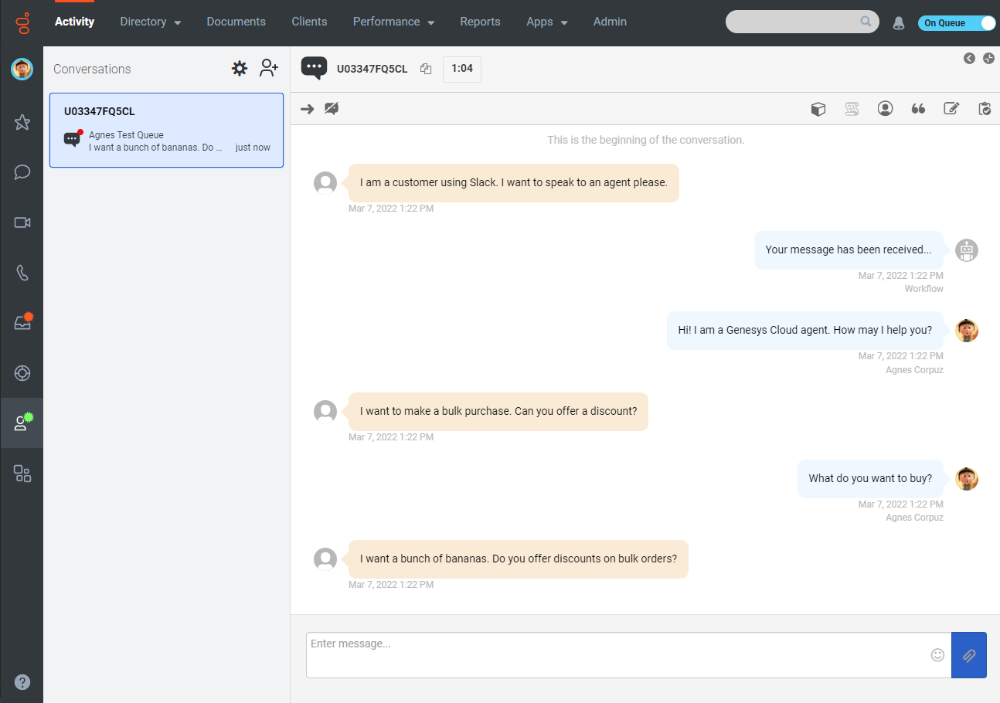

## Additional resources

* [Genesys Cloud Platform Client SDK](https://developer.mypurecloud.com/api/rest/client-libraries/ "Opens the Genesys Cloud Platform Client SDK page")
* [Open Messaging](https://developer.genesys.cloud/api/digital/openmessaging/ "Opens the Open messaging page")
* [Sending messages using Incoming Webhooks](https://api.slack.com/messaging/webhooks "Opens Sending messages using Incoming Webhooks")
* [Slack-open-messaging-blueprint repository](https://github.com/GenesysCloudBlueprints/slack-open-messaging-blueprint "Opens the slack-open-messaging-blueprint repository in GitHub")
